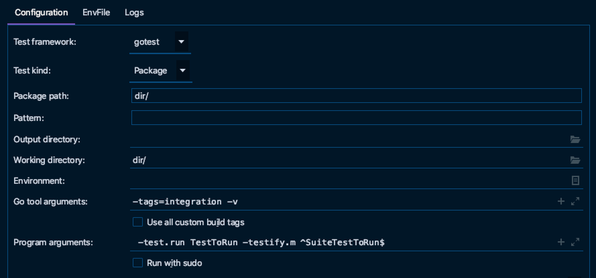

## Run a single test

```
go test ./... -run TestToRun
```

## Run a single suite test

```
go test ./... -run TestToRun -testify.m SuiteTestToRun

// Example running in a single directory, with a custom tag, in verbose mode
go test dir/*.go -tags=integration -v -run TestToRun -testify.m SuiteTestToRun
```

### Goland Debugger Equivalent


